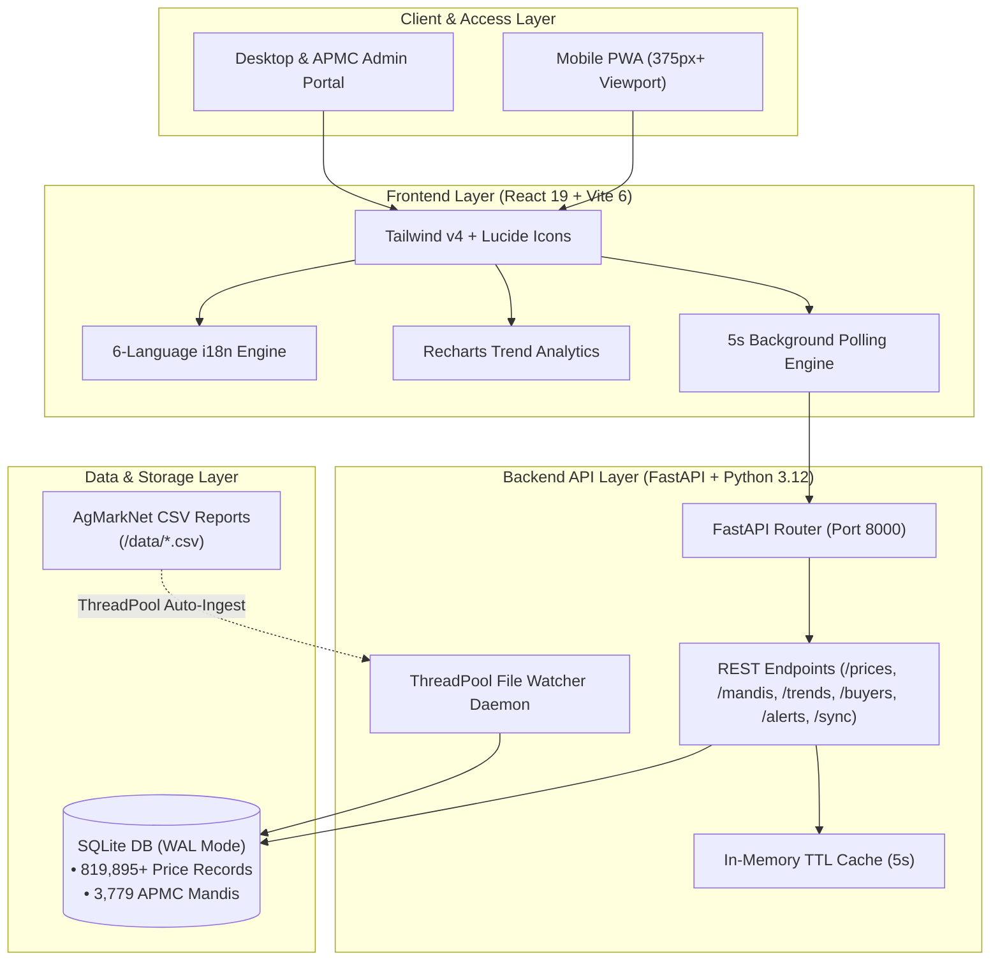

# KisanMandi (किसानमंडी) — Indian Agricultural Price Discovery & Direct Trade Platform

<div align="center">


**Empowering 140M+ Indian Farmers with Real-Time APMC Market Prices, Direct Buyer Access & 6-Language Localization**

[](https://fastapi.tiangolo.com)
[](https://react.dev)
[](https://www.typescriptlang.org)
[](https://tailwindcss.com)
[](https://www.sqlite.org)
[](https://www.python.org)
[](LICENSE)

[Architecture Overview](#system-architecture) •
[Key Features](#key-features) •
[Live Metrics](#live-dataset--performance-metrics) •
[Quickstart](#quickstart--local-development) •
[API Reference](#api-reference) •
[Testing](#testing--quality-assurance)

</div>

---

## Executive Summary

In India's agricultural ecosystem, smallholder farmers lose **15% to 30% of crop value** due to market price opacity, reliance on local middlemen, and delayed price discovery across APMC (Agricultural Produce Market Committee) mandis.

**KisanMandi** bridges this information asymmetry by delivering a **mobile-first, zero-latency price discovery and direct trade platform**. Powered by official government **AgMarkNet daily arrivals** and a **2-year historical market dataset (819,000+ records across 3,779 APMCs)**, KisanMandi equips farmers with instantaneous market intelligence, trend analytics, threshold price alerts, and direct buyer communication links.

---

## System Architecture

KisanMandi is designed with a decoupled architecture separating a high-performance **FastAPI backend** (with thread pool ingestion and in-memory TTL caching) from a responsive **React 19 single-page client**.



### Technology Stack Breakdown

| Layer | Technology | Purpose / Rationale |
|---|---|---|
| **Frontend Framework** | **React 19 + TypeScript 5.7** | Type-safe UI rendering with concurrent mode and zero-runtime overhead |
| **Build System** | **Vite 6** | Instant HMR and optimized asset bundling |
| **Styling** | **Tailwind CSS v4** | CSS-first styling using modern design tokens and CSS variables |
| **Visualization** | **Recharts 2.15** | Dynamic, responsive price trend charts (Min, Max, Modal prices) |
| **Icons & Assets** | **Lucide React** | Accessible SVG iconography tailored for high-contrast mobile readability |
| **Backend Framework** | **FastAPI 0.115** | Async Python REST framework with automatic OpenAPI spec generation |
| **ORM & Database** | **SQLAlchemy 2.0 + SQLite WAL** | Write-Ahead Logging for non-blocking concurrent reads and writes |
| **Data Ingestion** | **ThreadPoolExecutor + Pandas** | Parallel incremental CSV parser for rapid AgMarkNet report imports |
| **Integration Testing** | **Hurl + Pytest** | End-to-end HTTP assertion tests and contract validation |

---

## Key Features

### 1. Real-Time APMC Price & Arrival Discovery
- Live price tracking across **3,779 APMC Mandis** spanning **29 Indian States and Union Territories**.
- Provides Min Price, Max Price, and **Modal Price** (₹/Quintal) alongside daily arrival volumes.
- Multi-parameter filtering by crop, state, mandi, and date range.

### 2. Mobile-First Farmer-Centric Design
- Designed specifically for field conditions: sunny-readability, large 48px+ touch targets, and high-contrast color scheme.
- Fixed bottom thumb navigation bar allowing seamless single-hand phone usage.

### 3. 6-Language Native Localization (i18n)
- Zero-latency language switcher covering **English, हिन्दी (Hindi), मराठी (Marathi), தமிழ் (Tamil), తెలుగు (Telugu), and മലയാളം (Malayalam)**.
- Localized dynamic crop names, state designations, navigation labels, and metrics.

### 4. Interactive Multi-Period Trend Analytics
- Historical price charts across **7 days, 30 days, 90 days, and 1 year**.
- Displays price spread indicators, modal averages, percentage price changes, and volatility markers.

### 5. Direct Buyer Directory (Zero Middlemen)
- Direct contact details for verified institutional aggregators, millers, and bulk buyers.
- One-tap direct **Phone Calls (`tel:`)** and pre-filled **WhatsApp Chat (`https://wa.me/`)** trade negotiations.

### 6. Custom Threshold Price Alerts
- Instant price alert configuration (e.g. *"Alert when Wheat price in Punjab exceeds ₹2,450/Qtl"*).
- Live target price matching engine indicating status (Triggered vs. Monitoring).

### 7. Multi-Threaded Daemon File Watcher
- Background watcher monitoring `/data` for official government AgMarkNet daily CSV reports.
- Automatically processes, standardizes, deduplicates, and ingests new reports within **5 seconds** without server downtime.

---

## Live Dataset & Performance Metrics

| Metric | Measurement / Specification |
|---|---|
| **Total Price Database Records** | **819,895+** records |
| **Covered APMC Mandis** | **3,779 mandis** |
| **Tracked Master Commodities** | **7 core crops** (Rice/Paddy, Wheat, Onion, Tomato, Potato, Maize, Tur/Arhar) |
| **Geographic Coverage** | **29 States & UTs** across India |
| **CSV Ingestion Speed** | **0.66 seconds** per 54,000+ row dataset (Multi-threaded Pandas engine) |
| **API Response Latency** | **< 10 ms** average endpoint response time |
| **Polling Interval** | **5 seconds** background automated sync |

---

## Project Directory Structure

```
AJCE Hackathon/
├── backend/                  # FastAPI Application Source
│   └── app/
│       ├── main.py           # Application entrypoint & middleware setup
│       ├── database.py       # SQLite WAL engine configuration & session provider
│       ├── models.py         # SQLAlchemy ORM models (Price, Mandi, Crop, Buyer, Alert)
│       ├── schemas.py        # Pydantic v2 request/response schemas
│       ├── crud.py           # Optimized database queries & aggregations
│       ├── routers/          # REST Endpoint Routers
│       │   ├── prices.py     # GET /api/v1/prices & GET /api/v1/crops
│       │   ├── mandis.py     # GET /api/v1/mandis & GET /api/v1/mandis/{id}/prices
│       │   ├── trends.py     # GET /api/v1/trends/{crop}
│       │   ├── buyers.py     # GET /api/v1/buyers
│       │   ├── alerts.py     # POST/GET/DELETE /api/v1/alerts
│       │   ├── stats.py      # GET /api/v1/stats
│       │   └── sync.py       # POST /api/v1/sync & GET /api/v1/sync/status
│       └── services/
│           ├── cache.py      # In-memory TTL cache service
│           └── ingestion.py  # ThreadPool CSV file watcher & auto-seeder daemon
├── frontend/                 # React 19 + Vite Frontend Application
│   ├── src/
│   │   ├── api/              # Typed Fetch Client & API contracts
│   │   ├── components/       # UI Component Library
│   │   │   ├── Header.tsx        # Header with pulse & language selector
│   │   │   ├── BottomNav.tsx     # Mobile thumb navigation bar
│   │   │   ├── StatsTicker.tsx   # Market stats ticker & crop filter pills
│   │   │   ├── DashboardPage.tsx # Market arrivals price grid
│   │   │   ├── TrendsPage.tsx    # Interactive Recharts price trend charts
│   │   │   ├── BuyersPage.tsx    # Direct aggregator directory
│   │   │   ├── AlertsPage.tsx    # Price threshold alert creation & tracking
│   │   │   └── Footer.tsx        # AgMarkNet attribution footer
│   │   ├── context/          # React Context (Language Provider)
│   │   ├── i18n/             # 6-Language translation dictionaries
│   │   ├── App.tsx           # Main App layout & 5s polling loop
│   │   ├── main.tsx          # React DOM entrypoint
│   │   └── index.css         # Tailwind v4 configuration & base styles
│   └── vite.config.ts        # Vite config with API proxy setup
├── data/                     # AgMarkNet Daily Reports & Kaggle 2-Year Dataset
├── scripts/                  # Helper Utilities
│   ├── generate_sample_csv.py       # Mock AgMarkNet report generator
│   └── commit_files_sequentially.py # Atomic 1-file-per-commit git utility
├── tests/                    # Integration & Unit Test Suites
│   ├── api_tests.hurl        # 14-step Hurl integration test spec
│   └── test_api.py           # 11-step Pytest endpoint unit test suite
├── main.py                   # Root Uvicorn server launcher
├── seed_data.py              # CLI Seeder for initial data population
├── test.sh                   # Unified test runner script
└── requirements.txt          # Python dependencies manifest
```

---

## Quickstart & Local Development

### Prerequisites
- **Python**: 3.12 or higher
- **Node.js**: 18.0 or higher (Node v20+ recommended)
- **Git**: 2.30+

---

### Step 1: Clone Repository
```bash
git clone https://github.com/<your-username>/KisanMandi-Agri.git
cd KisanMandi-Agri
```

---

### Step 2: Backend Setup & Execution
```bash
# 1. Create a Python virtual environment
python3 -m venv .venv
source .venv/bin/activate  # On Windows: .venv\Scripts\activate

# 2. Install Python dependencies
pip install -r requirements.txt

# 3. Seed initial database from AgMarkNet & Kaggle datasets
python seed_data.py

# 4. Launch FastAPI development server
uvicorn main:app --reload --host 0.0.0.0 --port 8000
```
- **Interactive Swagger Documentation**: [http://localhost:8000/docs](http://localhost:8000/docs)
- **OpenAPI Schema JSON**: [http://localhost:8000/openapi.json](http://localhost:8000/openapi.json)

---

### Step 3: Frontend Setup & Execution
```bash
# In a separate terminal window:
cd frontend

# 1. Install Node dependencies
npm install

# 2. Start Vite development server
npm run dev -- --host
```
- **Local Application Access**: [http://localhost:5173](http://localhost:5173)
- **Mobile Wi-Fi Testing**: Open `http://<YOUR_LOCAL_IP>:5173` on any smartphone connected to the local network.

---

## API Reference

### Core Endpoints Specification

| Method | Endpoint Path | Query / Body Parameters | Description |
|---|---|---|---|
| `GET` | `/api/v1/prices` | `crop`, `state`, `mandi`, `days`, `limit`, `offset` | Search arrival prices with multi-parameter filtering |
| `GET` | `/api/v1/mandis` | `state` | List registered APMC mandis across Indian states |
| `GET` | `/api/v1/mandis/{id}/prices` | `limit`, `offset` | Historical prices for a specific mandi |
| `GET` | `/api/v1/trends/{crop}` | `state`, `days` | Aggregated daily average, min, max, volume & trend change |
| `GET` | `/api/v1/buyers` | `crop`, `state` | Verified aggregator directory with contact details |
| `POST` | `/api/v1/alerts` | `{ user_id, crop, threshold_price, alert_type }` | Create custom price threshold alert |
| `GET` | `/api/v1/alerts/{user_id}` | `user_id` | Retrieve active alerts with live evaluation status |
| `DELETE` | `/api/v1/alerts/{id}` | `id` | Delete existing price alert |
| `GET` | `/api/v1/stats` | — | High-level system statistics and top traded crops |
| `GET` | `/api/v1/crops` | — | Master list of supported agricultural commodities |
| `POST` | `/api/v1/sync` | — | Trigger manual incremental sync of `/data` files |
| `GET` | `/api/v1/sync/status` | — | Retrieve daemon watcher status and ingested file manifest |

---

### Sample HTTP Curl Requests

#### 1. Fetch Wheat Prices in Punjab (Last 30 Days)
```bash
curl -X GET "http://localhost:8000/api/v1/prices?crop=Wheat&state=Punjab&days=30&limit=10" \
  -H "accept: application/json"
```

#### 2. Get Historical Price Trend for Rice
```bash
curl -X GET "http://localhost:8000/api/v1/trends/Rice?state=Maharashtra&days=30" \
  -H "accept: application/json"
```

#### 3. Create a Farmer Price Alert
```bash
curl -X POST "http://localhost:8000/api/v1/alerts" \
  -H "Content-Type: application/json" \
  -d '{
    "user_id": "farmer_pb_01",
    "crop": "Wheat",
    "threshold_price": 2500.0,
    "alert_type": "above"
  }'
```

---

## Testing & Quality Assurance

KisanMandi includes an automated end-to-end testing pipeline combining **Hurl** for HTTP integration assertions and **Pytest** for backend unit test verification.

### Run Unified Test Suite
```bash
./test.sh
```

### Individual Test Commands

```bash
# 1. Execute Hurl 14-Step API Integration Suite
hurl --test tests/api_tests.hurl

# 2. Execute Pytest 11-Step Contract & Unit Suite
.venv/bin/pytest tests/test_api.py -v

# 3. Frontend TypeScript Typecheck & Production Build
cd frontend && npm run build
```

---

## Kerala Soil Erosion Monitor (Soil & Ecology Module)

The **Kerala Soil Erosion Monitor** is a full-stack geospatial module integrated into KisanMandi. It visualizes satellite-derived soil loss vulnerability across the **14 districts and 61+ taluks of Kerala** using the **Revised Universal Soil Loss Equation (RUSLE)**.

### Scientific Model: RUSLE Equation
$$A = R \times K \times LS \times C \times P$$

| Factor | Description | Standard Unit | Primary Data Source |
|---|---|---|---|
| **A** | Annual Soil Loss | t/ha/yr | Calculated Model Output |
| **R** | Rainfall Erosivity | MJ·mm/ha·h·yr | IMD / NASA GPM IMERG / CHIRPS Daily |
| **K** | Soil Erodibility | t·ha·h / ha·MJ·mm | OpenLandMap Soil Clay Content & Texture |
| **LS** | Slope Length & Steepness | Dimensionless | NASA SRTM 30m Digital Elevation Model |
| **C** | Cover-Management | 0.0 – 1.0 | Copernicus Sentinel-2 NDVI Index |
| **P** | Support Conservation Practice | 0.0 – 1.0 | Land use management & contour bunding policy |

### ICAR / NBSS&LUP Soil Degradation Classification
```
Low Risk:          A < 5     t/ha/yr  (#2ECC71 Green)
Moderate Risk:   5 ≤ A < 10  t/ha/yr  (#F1C40F Yellow)
High Risk:      10 ≤ A < 20 t/ha/yr  (#E67E22 Orange)
Severe Risk:    20 ≤ A < 40 t/ha/yr  (#E74C3C Red)
Very Severe:       A ≥ 40    t/ha/yr  (#8E44AD Purple)
```

### Geospatial Features & Interactive Capabilities
- **Multi-Basemap Leaflet Engine**: High-performance canvas choropleth with ESRI Satellite, Carto Dark Matter, OpenTopoMap, and OpenStreetMap basemaps.
- **Micro-Topographic Taluk Precision**: Seamlessly switch from 14 districts to 61+ revenue taluks with mean elevation, slope gradient, and localized soil series.
- **P-Factor Conservation Practice Simulator**: Interactive range slider ($P \in [0.35, 1.0]$) to simulate immediate topsoil loss reduction with contour terracing and vegetative hedgerows.
- **Custom Area of Interest (ROI) Circle Tool**: Tap anywhere on Kerala's topography to compute real-time zonal statistics (total survey area, mean/min/max loss, annual mass loss in metric tons, and prioritized conservation directives).
- **2018–2024 Climate Pulse Timeline**: 1400ms cyclic auto-playback slider annotated with Kerala historical extreme weather cycles (e.g. 2018 Centenary Floods, 2024 Western Ghats Surge).
- **Recharts Analytical Profiles**: Dynamic historical time-series curves and micro-watershed bar charts.
- **Swappable Satellite Gateway**: Offline Bundled GeoJSON (default with persistent Demo Badge), Google Earth Engine (GEE Proxy), and ISRO Bhuvan WMS.

### Soil & Ecology REST Endpoints
```bash
# 1. Soil Health & Dataset Availability
curl -s http://localhost:8000/api/v1/soil/health

# 2. Retrieve 14 Districts FeatureCollection (2024 active year)
curl -s "http://localhost:8000/api/v1/districts?year=2024"

# 3. Retrieve Taluks with Micro-Topography
curl -s "http://localhost:8000/api/v1/taluks?year=2024&district=wayanad"

# 4. Compute Custom Circle ROI Zonal Statistics (10km radius around Idukki)
curl -s -X POST http://localhost:8000/api/v1/roi/calculate \
  -H "Content-Type: application/json" \
  -d '{"lat": 10.06, "lng": 77.10, "radius_km": 10.0, "year": "2024"}'

# 5. Simulate Conservation Practice Benefit (Contour Bunding P = 0.45)
curl -s "http://localhost:8000/api/v1/rusle/simulate?p_factor=0.45&baseline_loss=58.0"
```

---

## Data Attribution & Governance

- **Government AgMarkNet Portal**: Directorate of Marketing & Inspection (DMI), Ministry of Agriculture and Farmers Welfare, Government of India ([agmarknet.gov.in](https://agmarknet.gov.in)).
- **Historical Market Dataset**: 2-year cleaned and standardized AgMarkNet dataset via Kaggle open agricultural data repository.
- **IMD & NASA GPM IMERG**: Precipitation erosivity measurements for rainfall R-factor estimation.
- **USGS SRTM**: NASA Shuttle Radar Topography Mission 30m global digital elevation model for LS topographic calculation.
- **Copernicus Sentinel-2**: European Space Agency 10m multispectral surface reflectance for NDVI C-factor monitoring.
- **ICAR / NBSS&LUP**: Indian Council of Agricultural Research & National Bureau of Soil Survey and Land Use Planning soil loss severity benchmarks.

---

## License

This project is licensed under the **MIT License** — see the [LICENSE](LICENSE) file for details.

---

<div align="center">
Built for Indian Farmers at AJCE Hackathon
</div>
