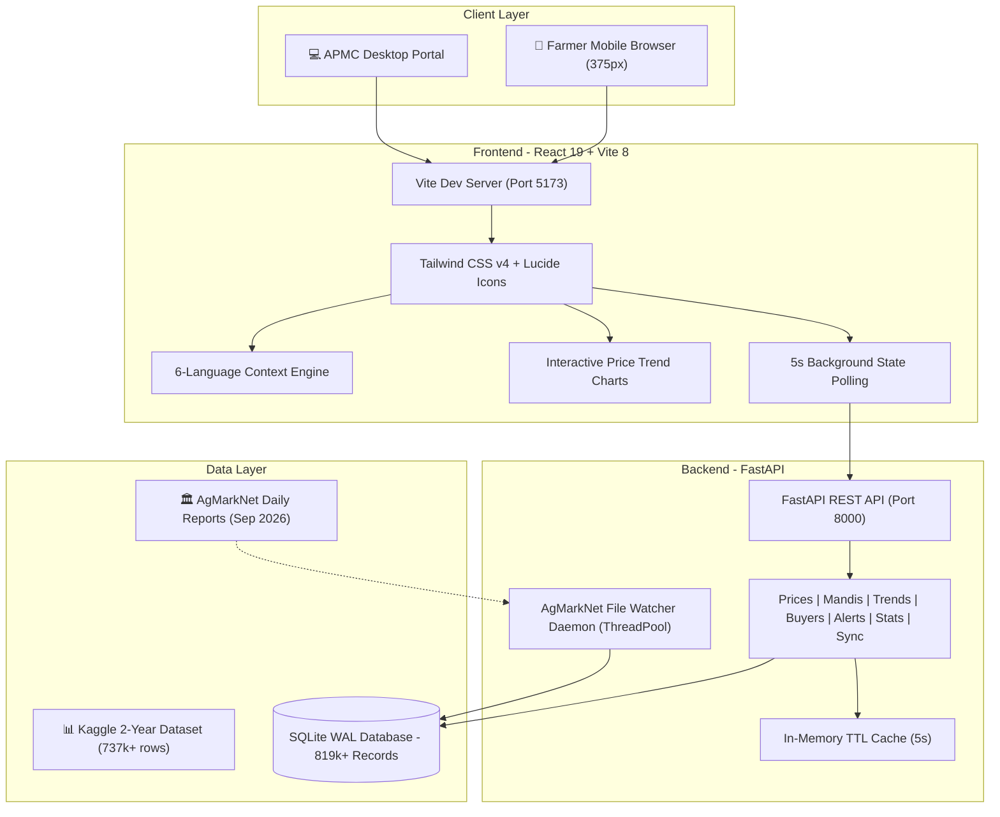

# 🌾 KisanMandi — Farmer Market Price Discovery Platform

> A production-grade, mobile-first agricultural price discovery and direct trade platform for Indian farmers, powered by official government AgMarkNet daily arrivals and 2-year historical market data.


---

## 🌟 Key Features

- **🌾 Live APMC Arrivals & Modal Prices**: Real-time arrival volumes and price discovery across 3,779+ APMC Mandis across all 28 Indian states & 8 Union Territories.
- **📱 Mobile-First Farmer UI/UX**: Designed for sunny field readability with large touch targets, high-contrast cards, and persistent bottom thumb navigation.
- **🇮🇳 6 Indian Languages Supported**: Zero-latency instant language switching between **English, हिन्दी (Hindi), मराठी (Marathi), தமிழ் (Tamil), తెలుగు (Telugu), and മലയാളം (Malayalam)**.
- **📈 Interactive Price Trends**: Historical 7-day, 30-day, 90-day, and 1-year commodity price graphs powered by Recharts with min/max/average spreads and % movement indicators.
- **🤝 Direct Buyer Directory**: Direct contact links (Call & WhatsApp pre-filled messages) to verified institutional bulk buyers, millers, and aggregators without middlemen.
- **🔔 Farmer Price Threshold Alerts**: Custom SMS/notification threshold alerts (e.g. *"Alert when Wheat in Maharashtra crosses ₹2,600/Qtl"*).
- **⚡ Auto-Sync Live File Watcher**: A multi-threaded daemon automatically detects and incrementally imports new AgMarkNet daily reports within 5 seconds of being dropped in `/data`.
- **🚀 Ultra-Fast SLAs**: SQLite WAL mode + in-memory TTL caching delivering sub-10ms API responses and 5-second polling without page reloads.

---

## 🏗️ Architecture Overview



---

## 📊 Live Dataset Metrics

| Metric | Value |
|---|---|
| **Total Price Records** | **819,895+** |
| **Total Active Mandis** | **3,779 APMCs** across India |
| **Tracked Master Crops** | **7** (Rice/Paddy, Wheat, Onion, Tomato, Potato, Maize, Tur/Arhar) |
| **States & UTs Covered** | **36** (All 28 States + 8 Union Territories) |
| **Ingestion Speed** | **0.66 seconds** for 54k+ new records (Multi-threaded) |
| **API Response Time** | **< 10ms** across all endpoints |

---

## 🚀 Quickstart & Local Setup

### Prerequisites
- Python 3.12+
- Node.js 18+ (tested on Node v26)
- Git

---

### Step 1: Clone Repository
```bash
git clone <repo-url>
cd "AJCE Hackathon"
```

---

### Step 2: Backend Setup (FastAPI)
```bash
# 1. Create and activate virtual environment
python3 -m venv .venv
source .venv/bin/activate

# 2. Install dependencies
pip install -r requirements.txt

# 3. Seed initial real datasets (AgMarkNet daily reports + Kaggle dataset)
python seed_data.py

# 4. Run backend server (Port 8000)
uvicorn main:app --reload --port 8000
```
- Swagger Interactive Docs: [http://localhost:8000/docs](http://localhost:8000/docs)
- Healthcheck: [http://localhost:8000/health](http://localhost:8000/health)

---

### Step 3: Frontend Setup (React 19)
```bash
# In a new terminal:
cd frontend

# 1. Install dependencies
npm install

# 2. Run frontend development server
npm run dev -- --host
```
- Web Application: [http://localhost:5173](http://localhost:5173)
- **Local Network Testing**: Access on your phone connected to the same Wi-Fi using `http://[YOUR_MACHINE_IP]:5173`.

---

## 🧪 Testing & Verification

Run the unified test runner to execute both **Hurl** end-to-end integration tests and **Pytest** unit tests:
```bash
./test.sh
```

### Individual Test Commands:
```bash
# 1. Hurl API Test Suite (14 Tests)
hurl --test tests/api_tests.hurl

# 2. Pytest Contract Tests (11 Tests)
.venv/bin/pytest tests/test_api.py -v

# 3. Frontend TypeScript Typecheck & Build
cd frontend && npm run build
```

---

## 📡 API Reference

| Method | Endpoint | Description |
|---|---|---|
| `GET` | `/api/v1/prices` | Search arrival prices with `crop`, `state`, `mandi`, `days`, `start_date`, `end_date` filters |
| `GET` | `/api/v1/mandis` | List all registered APMC mandis across Indian states |
| `GET` | `/api/v1/mandis/{id}/prices` | Arrival prices for a specific mandi |
| `GET` | `/api/v1/trends/{crop}` | Daily average, min, max, volume trends & % movement |
| `GET` | `/api/v1/buyers` | Verified buyer directory filtered by crop and location |
| `POST` | `/api/v1/alerts` | Create custom farmer price threshold alert |
| `GET` | `/api/v1/alerts/{userId}` | List active alerts with live target evaluation |
| `DELETE` | `/api/v1/alerts/{id}` | Delete a price alert |
| `GET` | `/api/v1/stats` | High-level statistics, records count, top traded crops |
| `GET` | `/api/v1/crops` | Master crops list |
| `POST` | `/api/v1/sync` | Trigger incremental multi-threaded AgMarkNet CSV sync |
| `GET` | `/api/v1/sync/status` | Ingestion status and processed file manifest |

---

## 🏛️ Data Source Attribution

- **AgMarkNet Portal**: Directorate of Marketing & Inspection (DMI), Ministry of Agriculture and Farmers Welfare, Government of India ([https://agmarknet.gov.in](https://agmarknet.gov.in)).
- **Historical Agricultural Dataset**: 2-year cleaned and standardized AgMarkNet dataset via Kaggle.

---

## 🔮 Future Scope
- Automated WhatsApp & SMS alerts via Twilio / Gupshup.
- Offline-first PWA caching with Service Workers for remote farms with poor connectivity.
- Predictive price forecasting using machine learning time-series models.
