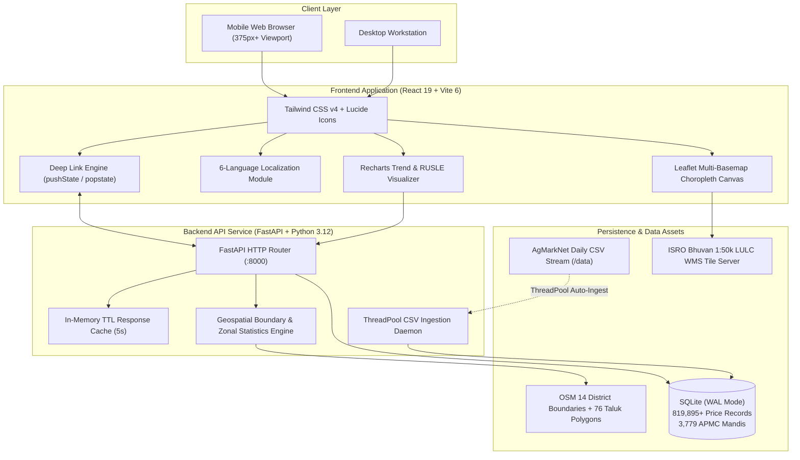

# KisanMandi

> A unified agricultural price discovery, direct farmer trade, and geospatial soil erosion monitoring platform designed for Indian smallholder farmers and agrarian stakeholders.

KisanMandi bridges information asymmetry in India's agricultural ecosystem by pairing real-time APMC (Agricultural Produce Market Committee) mandi arrivals and price discovery with high-resolution geospatial soil degradation monitoring. It integrates official daily mandi reports, a 2-year historical market dataset (819,000+ records across 3,779 mandis), and satellite-derived RUSLE (Revised Universal Soil Loss Equation) soil loss modeling across Kerala's 14 districts and 76 taluks.

---

## Architecture

KisanMandi is architectured as a decoupled full-stack system comprising a high-throughput FastAPI service and an optimized React 19 single-page application.



### Technology Stack

| Layer | Component | Technical Selection & Role |
|---|---|---|
| **Frontend Core** | React 19, TypeScript 5.7 | Strict type-safe UI, concurrent rendering, zero runtime overhead |
| **Build & Bundler** | Vite 6 | Sub-second Hot Module Replacement (HMR) and optimized tree-shaken production bundles |
| **Styling** | Tailwind CSS v4 | CSS-first design token architecture, mobile-first responsive layout |
| **Mapping Engine** | Leaflet 1.9, React-Leaflet | Canvas-rendered polygon choropleths, circular ROI zonal overlays, tile switching |
| **Charts** | Recharts 2.15 | Price band timelines (Min, Modal, Max) and multi-year RUSLE erosion trajectories |
| **Backend Framework** | FastAPI 0.115, Pydantic v2 | Asynchronous ASGI framework with automated OpenAPI 3.1 schema generation |
| **Database & ORM** | SQLAlchemy 2.0, SQLite (WAL Mode) | Write-Ahead Logging for high-concurrency non-blocking reads during file ingestion |
| **Data Ingestion** | Python `ThreadPoolExecutor`, Pandas | Parallel background CSV parsing and schema normalization |
| **Geospatial Processing** | Shapely, GeoJSON | Exact point-in-polygon containment, circular ROI clipping, and zonal statistics |
| **Testing** | Pytest, Hurl | Unit contract testing and declarative HTTP end-to-end integration tests |

---

## Core Capabilities

### 1. APMC Price Discovery & Market Arrival Feeds
- **Nationwide Coverage**: Tracks arrivals and modal prices across 3,779 APMC mandis spanning 29 Indian States and Union Territories.
- **Granular Price Quotes**: Real-time reporting of Minimum, Maximum, and Modal prices (in ₹/Quintal) alongside daily incoming volume.
- **Faceted Filtering**: Search and filter by crop, state, APMC market, and historical intervals (7, 30, 90, 365 days).

### 2. Kerala Soil Erosion Monitor
- **Scientific Foundation**: Computes annual gross soil loss using the Revised Universal Soil Loss Equation:
  $$A = R \times K \times LS \times C \times P$$
  Where $A$ is soil loss ($t/ha/yr$), $R$ is rainfall erosivity (IMD / NASA GPM), $K$ is soil erodibility (NBSS&LUP), $LS$ is topographic length-slope (SRTM 30m), $C$ is cover management (Sentinel-2 NDVI), and $P$ is support conservation practice.
- **Hierarchical Jurisdictions**:
  - **14 Kerala Districts**: Multi-polygon OpenStreetMap boundaries reflecting exact administrative borders.
  - **76 Revenue Taluks**: Micro-topographic boundaries incorporating mean elevation, slope gradients, and predominant soil types.
- **ISRO Bhuvan Integration**: Direct live WMS overlay from the National Remote Sensing Centre (NRSC / ISRO) for 1:50,000 Land Use / Land Cover (LULC) verification.
- **Interactive Circle ROI Tool**: Tap anywhere on the map to define a circular Area of Interest (radius 1–50 km) and calculate real-time zonal statistics: mean/min/max erosion rate, total annual metric tonnage lost, and prioritized conservation interventions.
- **P-Factor Remediation Simulator**: Interactive parameter adjustment ($P \in [0.35, 1.0]$) demonstrating immediate topsoil conservation impacts from contour bunding, terracing, and vegetative hedgerows.
- **Historical Climate Pulse (2018–2024)**: Multi-year timeline with auto-playback tracking the impact of extreme weather events (e.g., 2018 Centenary Floods, 2024 Western Ghats surge).

### 3. Direct Trade & Farmer Directory
- **Zero Middlemen**: Verified directory of institutional aggregators, millers, and bulk buyers categorized by crop and state.
- **One-Tap Negotiation**: Integrated action triggers for direct phone calls (`tel:`) and pre-filled WhatsApp trade agreements (`https://wa.me/`).

### 4. Deep Linking & State Synchronization
- **Bidirectional Query Synchronization**: Full browser history integration (`pushState` / `popstate`) syncing active tab, crop, state, mandi search, soil region, year, and zoom levels directly into the URL.
- **Field-Ready Sharing**: One-click generation of WhatsApp preview messages containing formatted market rates, spreads, and direct access links for farmer community groups.

### 5. Native 6-Language Localization (i18n)
- Comprehensive interface translation supporting **English**, **हिन्दी (Hindi)**, **मराठी (Marathi)**, **தமிழ் (Tamil)**, **తెలుగు (Telugu)**, and **മലയാളം (Malayalam)**.
- Localized commodity names, agricultural metrics, navigation items, and soil advisory notifications.

---

## Dataset & Performance Specifications

| Metric | Specification |
|---|---|
| **Price Database Size** | 819,895+ validated AgMarkNet arrival records |
| **Monitored Mandis** | 3,779 registered APMC market yards |
| **Commodity Classes** | Rice/Paddy, Wheat, Onion, Tomato, Potato, Maize, Tur/Arhar |
| **Geographic Extent** | 29 States & UTs (Market Data) • 14 Districts & 76 Taluks (Soil Data) |
| **CSV Ingestion Latency** | ~0.66 seconds per 54,000-row batch via Pandas engine |
| **Average Query Latency** | < 10 ms for cached endpoints; < 25 ms for full-table SQLite index scans |
| **Watcher Synchronization** | Inotify/polling hybrid daemon scanning `/data` every 5 seconds |

---

## Repository Structure

```
AJCE Hackathon/
├── backend/
│   └── app/
│       ├── main.py              # Application entrypoint & middleware setup
│       ├── database.py          # SQLite WAL configuration & session factory
│       ├── models.py            # SQLAlchemy models (Price, Mandi, Crop, Buyer, Alert)
│       ├── schemas.py           # Pydantic v2 request/response contracts
│       ├── crud.py              # Database query logic & aggregations
│       ├── assets/              # Geospatial GeoJSON boundary datasets
│       ├── routers/             # Modular REST route controllers
│       │   ├── prices.py        # /api/v1/prices & /api/v1/crops
│       │   ├── mandis.py        # /api/v1/mandis & historical quotes
│       │   ├── trends.py        # /api/v1/trends/{crop}
│       │   ├── buyers.py        # /api/v1/buyers
│       │   ├── alerts.py        # /api/v1/alerts
│       │   ├── stats.py         # /api/v1/stats
│       │   ├── sync.py          # /api/v1/sync status & manual trigger
│       │   └── soil.py          # /api/v1/districts, /taluks, /roi, /rusle
│       └── services/
│           ├── cache.py         # In-memory TTL cache
│           └── ingestion.py     # Background CSV parser & file-watcher daemon
├── frontend/
│   ├── src/
│   │   ├── api/                 # Typed API client & contracts
│   │   ├── components/          # React presentation & container components
│   │   │   ├── DashboardPage.tsx
│   │   │   ├── TrendsPage.tsx
│   │   │   ├── BuyersPage.tsx
│   │   │   ├── AlertsPage.tsx
│   │   │   ├── Header.tsx
│   │   │   ├── BottomNav.tsx
│   │   │   ├── StatsTicker.tsx
│   │   │   ├── ShareButton.tsx
│   │   │   ├── ShareModal.tsx
│   │   │   └── soil/            # Kerala Soil Monitor view & controls
│   │   │       ├── KeralaMap.tsx
│   │   │       ├── SoilMonitorView.tsx
│   │   │       ├── DistrictDetailPanel.tsx
│   │   │       ├── TalukDetailPanel.tsx
│   │   │       ├── RoiStatsCard.tsx
│   │   │       ├── RusleBreakdownBars.tsx
│   │   │       ├── TimeSlider.tsx
│   │   │       ├── LayerSwitcher.tsx
│   │   │       └── MapLegend.tsx
│   │   ├── context/             # React context providers (Language, Auth)
│   │   ├── i18n/                # Translation catalogs for 6 languages
│   │   ├── utils/               # Deep link sync & URL serialization
│   │   └── App.tsx              # Root shell, routing, and background sync
│   ├── package.json
│   └── vite.config.ts
├── data/                        # AgMarkNet daily reports & historical CSV archives
├── tests/
│   ├── api_tests.hurl           # Hurl declarative API integration suite
│   └── test_api.py              # Pytest backend functional test suite
├── seed_data.py                 # Standalone database ingestion script
├── run.sh                       # Unified single-command launcher
├── test.sh                      # Unified test runner
└── requirements.txt             # Python dependency manifest
```

---

## Quickstart & Local Setup

### Prerequisites
- **Python**: 3.12 or higher
- **Node.js**: 20.0 or higher
- **Git**: 2.30+

### Option A: Single-Command Launch

A shell launcher is provided to spin up both the FastAPI backend and Vite frontend with unified logging:

```bash
chmod +x run.sh test.sh
./run.sh
```

- Web Interface: [http://localhost:5173](http://localhost:5173)
- Interactive Swagger Documentation: [http://localhost:8000/docs](http://localhost:8000/docs)

---

### Option B: Manual Service Startup

#### 1. Backend Service
```bash
# Create and activate virtual environment
python3 -m venv .venv
source .venv/bin/activate

# Install dependencies
pip install -r requirements.txt

# Ingest initial datasets into SQLite database
python seed_data.py

# Launch FastAPI ASGI server
uvicorn main:app --reload --host 0.0.0.0 --port 8000
```

#### 2. Frontend Client
```bash
cd frontend

# Install Node packages
npm install

# Start Vite development server
npm run dev -- --host
```

---

## API Reference

### Market & APMC Endpoints

| Method | Route | Parameters | Description |
|---|---|---|---|
| `GET` | `/api/v1/prices` | `crop`, `state`, `mandi`, `days`, `limit`, `offset` | Query arrival prices with multi-dimensional filtering |
| `GET` | `/api/v1/mandis` | `state` | List registered APMC mandis by state |
| `GET` | `/api/v1/mandis/{id}/prices` | `limit`, `offset` | Fetch historical arrival log for a specific market |
| `GET` | `/api/v1/trends/{crop}` | `state`, `days` | Aggregated daily metrics (Min, Max, Modal, Volume) |
| `GET` | `/api/v1/buyers` | `crop`, `state` | Verified aggregator and institutional buyer directory |
| `POST` | `/api/v1/alerts` | `{ user_id, crop, threshold_price, alert_type }` | Create automated price threshold alert |
| `GET` | `/api/v1/alerts/{user_id}` | `user_id` | Retrieve active user alerts with evaluation status |
| `DELETE` | `/api/v1/alerts/{id}` | `id` | Remove existing price alert |
| `GET` | `/api/v1/stats` | — | Summary statistics, total volume, and top traded commodities |
| `GET` | `/api/v1/crops` | — | Master list of all registered crops |
| `POST` | `/api/v1/sync` | — | Force manual incremental sync of the `/data` folder |
| `GET` | `/api/v1/sync/status` | — | Retrieve file watcher daemon status and file ingestion audit log |

### Soil & Ecology Geospatial Endpoints

| Method | Route | Parameters | Description |
|---|---|---|---|
| `GET` | `/api/v1/soil/health` | — | Service health and layer availability manifest |
| `GET` | `/api/v1/districts` | `year` | Returns 14 Kerala district GeoJSON FeatureCollection with RUSLE properties |
| `GET` | `/api/v1/taluks` | `year`, `district` | Returns 76 Kerala taluks GeoJSON with micro-topographic metrics |
| `POST` | `/api/v1/roi/calculate` | `{ lat, lng, radius_km, year }` | Compute zonal soil loss statistics for a custom circular area |
| `GET` | `/api/v1/rusle/simulate` | `p_factor`, `baseline_loss` | Calculate immediate erosion reduction given a conservation practice factor |
| `GET` | `/api/v1/layers/bhuvan-wms` | — | Active NRSC ISRO Bhuvan WMS endpoint configurations and attribution |

---

## Deep Linking Specification

KisanMandi serializes UI state directly into the browser address bar. This allows farmers to share customized views across messaging applications:

| Parameter | Accepted Values | Function |
|---|---|---|
| `tab` | `dashboard`, `trends`, `buyers`, `alerts`, `soil` | Active view |
| `lang` | `hi`, `en`, `pa`, `mr`, `te`, `ta`, `ml` | Interface locale |
| `crop` | Commodity string (e.g. `Wheat`, `Rice`) | Pre-filter market dashboard or trends |
| `state` | State string (e.g. `Punjab`, `Kerala`) | Pre-filter geographic market region |
| `days` | `7`, `30`, `90`, `365` | Historical price interval |
| `q` | Search string | Text query for APMC market search |
| `region` | Identifier (e.g. `wayanad`, `vythiri`) | Fly-to target and auto-select in Soil Monitor |
| `granularity` | `district`, `taluk` | Geospatial boundary detail level |
| `year` | `2018` to `2024` | Active RUSLE assessment baseline year |

**Example URL**:
```text
http://localhost:5173/?tab=soil&region=wayanad&granularity=taluk&year=2024
```

---

## Testing & Quality Assurance

The test suite validates both HTTP contracts and analytical logic:

```bash
# Execute entire test pipeline
./test.sh
```

### Individual Test Suites

1. **Backend Unit & Contract Verification (Pytest)**:
   ```bash
   .venv/bin/pytest tests/test_api.py -v
   ```
   Validates endpoint status codes, JSON response schemas, parameter filtering, and price alert evaluation logic.

2. **HTTP Integration Assertions (Hurl)**:
   ```bash
   hurl --test tests/api_tests.hurl
   ```
   Performs a 14-step declarative HTTP test sequence validating header correctness, serialization, and database write-read cycles.

3. **Frontend Compilation & Type Validation**:
   ```bash
   cd frontend && npm run build
   ```
   Executes TypeScript typechecking and compiles the production bundle via Vite.

---

## Data Governance & Attribution

- **AgMarkNet**: Directorate of Marketing & Inspection (DMI), Ministry of Agriculture and Farmers Welfare, Government of India ([agmarknet.gov.in](https://agmarknet.gov.in)).
- **ISRO Bhuvan**: National Remote Sensing Centre (NRSC), Indian Space Research Organisation ([bhuvan.nrsc.gov.in](https://bhuvan.nrsc.gov.in)) — 1:50,000 Land Use / Land Cover (LULC) WMS service.
- **Topographic Elevation**: NASA Shuttle Radar Topography Mission (SRTM) 30m Digital Elevation Model.
- **Meteorological Data**: India Meteorological Department (IMD) & NASA GPM IMERG precipitation erosivity datasets.
- **Administrative Boundaries**: OpenStreetMap contributors, licensed under the Open Database License (ODbL).

---

## License

This project is licensed under the MIT License. See [LICENSE](LICENSE) for terms.
